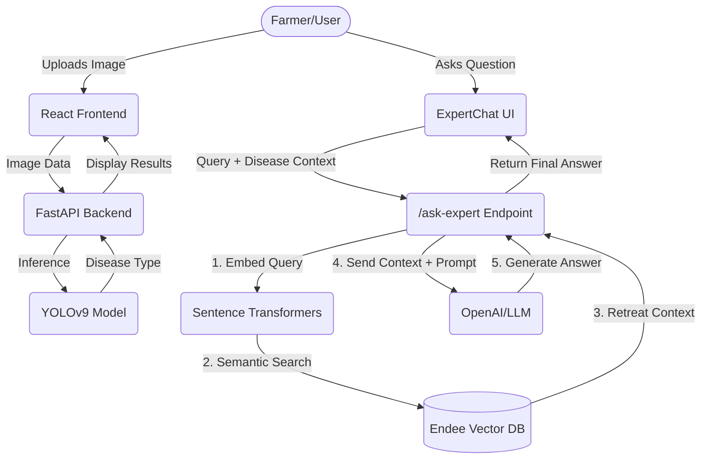

# Cotton Leaf Disease Detection & Expert AI (Powered by Endee Vector DB)


This project was built for the **Tap Academy / Endee.io** Hiring Evaluation. It is a full-stack, real-time disease detection system for cotton leaves that incorporates an **Agentic AI Workflow (Retrieval-Augmented Generation)** to assist farmers with localized treatment plans.

## 🌟 Project Overview

The core application uses a custom-trained YOLOv9 model to detect four classes of cotton leaf conditions in real-time (Bacterial Blight, Fusarium Wilt, Leaf Curl Virus, and Healthy Leaf).

**The Endee Integration (RAG):**
We elevated the project from a simple computer vision tool to a comprehensive agricultural assistant by integrating the **Endee Vector Database**. 
When a disease is detected, users can query the **Expert AI Chatbot**. The backend uses Endee to perform a semantic search over a knowledge base of agricultural documents, retrieving the exact treatment protocols, pesticide recommendations, and environmental controls for that specific disease. This context is then fed to an LLM to generate a precise, context-aware answer for the farmer.

## 🏗️ System Design



## 🔹 How Endee is Used

1. **Document Ingestion**: Agricultural PDFs and text files are processed, chunked, and embedded using `sentence-transformers` (all-MiniLM-L6-v2) via `backend/rag/document_processor.py`.
2. **Vector Storage**: These 384-dimensional embeddings, along with their text metadata, are inserted into the Endee Vector Database collection named `cotton_knowledge_base`.
3. **Semantic RAG Search**: In `backend/rag/expert_chatter.py`, when a user asks "How do I treat this?", the question is embedded and Endee is queried iteratively. The top matches (highest cosine similarity) are returned and injected into the LLM system prompt.

## 🚀 Setup Instructions

### Prerequisites
- Python 3.10+
- Node.js 18+
- [Endee Vector Database](https://github.com/endee-io/endee) running locally (e.g., via Docker container on port 8080)
- OpenAI API Key (for the LLM response generation)

### 1. Vector Database Setup
Follow the [Official Endee repo instructions](https://github.com/endee-io/endee) to start the Endee server. By default, our scripts expect it on `http://localhost:8080`.

### 2. Backend Setup
```bash
cd backend
python -m venv venv
venv\Scripts\activate  # On Windows. Use source venv/bin/activate on Mac/Linux

# Install dependencies
pip install -r requirements.txt
pip install endee langchain sentence-transformers openai pypdf

# Add your OpenAI Key
echo "OPENAI_API_KEY=your_key_here" >> .env

# Start FastAPI server
uvicorn main:app --reload --host 0.0.0.0 --port 8000
```

### 3. Populate Endee Knowledge Base
Before using the chat, you need to populate Endee with agricultural contexts:
```bash
# Add some agricultural PDF/Text guides to backend/data/agricultural_docs
# Then run the ingestor:
python backend/rag/document_processor.py
```

### 4. Frontend Setup (New Terminal)
```bash
cd frontend
npm install
npm run dev
```

The Web App will be available at `http://localhost:3000`.

## 📦 Project Structure Highlight
- `backend/rag/document_processor.py`: Endee insertion logic.
- `backend/rag/expert_chatter.py`: Endee semantic search and LLM context injection.
- `frontend/src/components/ExpertChat.jsx`: The RAG chat interface.

---
*Developed for the Tap Academy Hiring Evaluation.*
